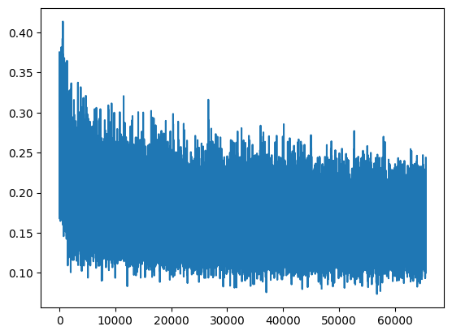
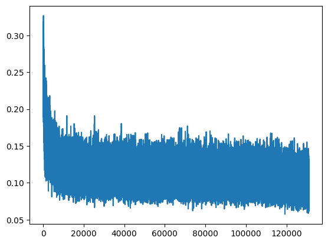
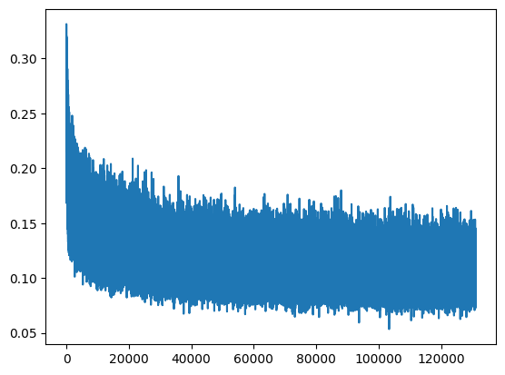

# Бот для оценки шахматных позиций
Эта нейросеть написанна специально для моей <a href="https://himer65.github.io">визитки.</a> 
Я старался сделать максимально маленькую и простую нейросеть, для того что бы она работала на стороне клиента.

<h3>V1: param - 2 743</h3>

<h3>V2: param - 15 655</h3>

<h3>V2.1: param - 15 655</h3>

<h3>V3: param - 8330</h3>

Датасет который я использовал: <a href="https://www.kaggle.com/datasets/ronakbadhe/chess-evaluations">Kaggle</a>