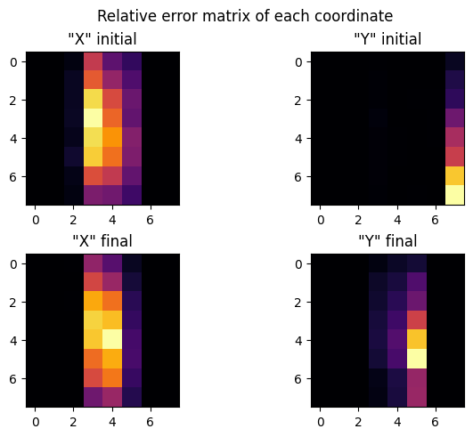
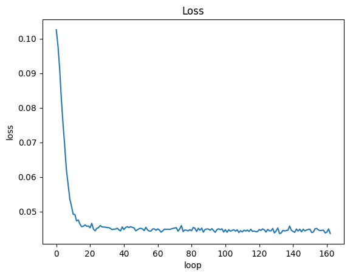
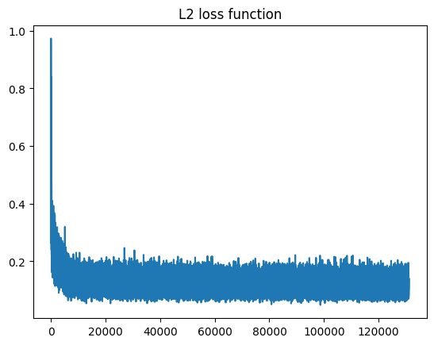
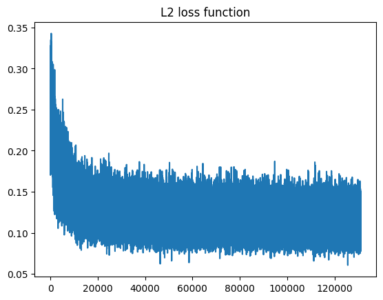
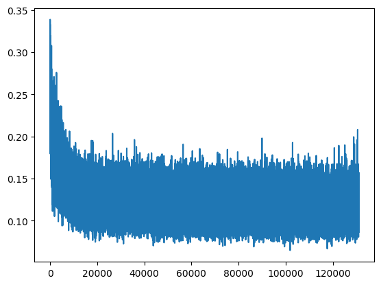

# Бот для игры в шахматы
Это максимально маленькая и простая нейросеть, работает на стороне клиента. Идея архитектуры основана на "оконном" внимании и долгосрочной памяти. Данные подготовлены таким оброзом что бы на вход нейросети подовались только ходы белых, на выходе ходы самого бота. Последняя версия V6.
На будущее:
1. Добавить память в модель
2. Добавить оптимизацию в модель. квантизация
# История развития
<h3>V6: param - 4224</h3>

<h3>V5.1: param - 1930</h3>

<h3>V5: param - 1930</h3>

<h3>V4.1: param - 7955</h3>

<h3>V4: param - 3905</h3>

<h3>V3: param - 8330</h3>

<h3>V2.1: param - 15 655</h3>

<h3>V2: param - 15 655</h3>

<h3>V1: param - 2 743</h3>

